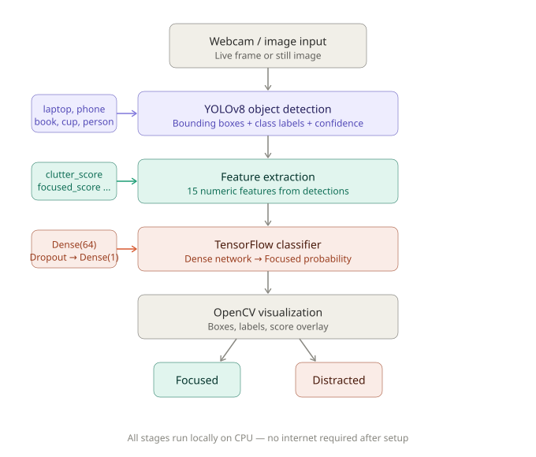

# Smart Workspace Monitor
### Context-aware object detection for productivity

A computer vision system that watches your desk through a webcam, detects objects using YOLOv8, and classifies your workspace as **Focused** or **Distracted** in real time — with a live overlay showing what it sees and why.


---

## What This Project Does

 This project takes a different approach — it looks at your physical workspace and decides whether you look like you're working or getting distracted, based on what objects are visible on your desk.

Point a webcam at your desk. The system detects objects like laptops, books, phones, and keyboards. It then computes a set of features from those detections — how many productive vs distracting items are visible, how cluttered the desk looks, what percentage of the frame is covered — and feeds those features into a small machine learning classifier that outputs a single verdict: **Focused** or **Distracted**, along with a confidence score.

The entire pipeline runs locally on CPU, in real time.

---

## How It Works — The Full Pipeline



Each stage is a separate, independently runnable module. You can swap out the classifier, change the feature set, or plug in a different detector without touching the rest.

---

## The Technology — Brief Explanations

### Object Detection with YOLOv8
YOLO (You Only Look Once) is a real-time object detection model. Given an image, it draws bounding boxes around every recognizable object and labels each one with a class name and confidence score. This project uses **YOLOv8 nano** — the smallest, fastest variant — pretrained on the COCO dataset, which includes 80 common object classes including most desk items.

No training was needed for the detection stage. The pretrained weights already know what a laptop, phone, book, and keyboard look like.

### Feature Extraction
Raw bounding boxes aren't directly useful for classifying workspace state. So detections get converted into a fixed-length numeric feature vector — 15 numbers that describe the workspace at a higher level:

| Feature | What it captures |
|---------|-----------------|
| `productive_count` | Number of work-related objects (laptop, book, keyboard) |
| `distracting_count` | Number of distraction objects (phone, TV, remote) |
| `focused_score` | `productive_ratio − distracting_ratio` |
| `clutter_score` | How crowded the desk looks (normalised object count) |
| `total_area_coverage` | What fraction of the frame objects occupy |
| `avg_confidence` | Mean YOLO detection confidence |
| `has_laptop / has_phone / has_book / has_person` | Binary presence flags |

This is the bridge between raw computer vision and machine learning.

### Context Classification with TensorFlow
A small fully-connected neural network takes the 15 features as input and outputs a single probability — how likely the workspace is "Focused". The architecture is intentionally lightweight:

```
Input (15 features)
      ↓
Dense(64) → BatchNorm → Dropout(0.3)
      ↓
Dense(32) → BatchNorm → Dropout(0.2)
      ↓
Dense(16)
      ↓
Dense(1, sigmoid)  →  Focused probability
```

Training uses binary cross-entropy loss, Adam optimizer, early stopping, and learning rate scheduling. Total parameters: ~4,000 — small enough to train in seconds on CPU.

### Visualization with OpenCV
OpenCV draws the results directly onto each video frame: color-coded bounding boxes (green = productive, red = distracting, cyan = neutral), a top banner showing the current workspace state and confidence, a live focus bar, and per-frame stats in the corner.

---

## Project Structure

```
smart-workspace-monitor/
│
├── dataset/
│   ├── raw_images/          # desk images used for testing
│   ├── labels/              # YOLO label files (.txt)
│   └── processed/
│       └── images.csv       # feature-extracted dataset
│
├── models/
│   ├── yolo/                # yolov8n.pt (auto-downloaded on first run)
│   └── context_classifier/
│       ├── context_model.keras   # trained TF model
│       ├── scaler.pkl            # fitted StandardScaler
│       └── feature_cols.json     # feature column order
│
├── src/
│   ├── detect_objects.py        # Phase 1 — run YOLO on images
│   ├── extract_features.py      # Phase 2 — detections → feature CSV
│   ├── train_context_model.py   # Phase 3 — train the classifier
│   ├── predict_context.py       # Phase 3 — predict on a single image
│   ├── webcam_demo.py           # Phase 4 — real-time webcam demo
│   └── quick_test.py            # sanity check: webcam + YOLO working?
│
├── results/
│   └── metrics/             # confusion matrix, ROC curve, training plots
│
├── notebooks/
│   └── experiments.ipynb    # EDA, evaluation charts, metrics summary
│
├── requirements.txt
└── README.md
```

---

## Setup

```bash
# 1. Clone the repo
git clone https://github.com/<your-username>/smart-workspace-monitor.git
cd smart-workspace-monitor

# 2. Create a virtual environment
python -m venv venv
venv\Scripts\activate        # Windows
# source venv/bin/activate   # Mac/Linux

# 3. Install dependencies
pip install -r requirements.txt
```

YOLOv8n weights (~6 MB) download automatically on first run. No GPU required — everything runs on CPU.

---

## Usage

### Quickest start — webcam demo

```bash
python src/webcam_demo.py
```

Point your camera at your desk. Controls: `Q` quit · `S` save frame · `P` pause.

---

### Run on a single image

```bash
python src/predict_context.py --image path/to/desk.jpg --save
```

Saves an annotated image to `results/sample_outputs/`.

---

### Train the classifier yourself

```bash
# Step 1: extract features from your labeled images
python src/extract_features.py --input dataset/raw_images --output dataset/processed/images.csv

# Step 2: train
python src/train_context_model.py
```

Outputs saved to `models/context_classifier/` and `results/metrics/`.

---

### Explore in the notebook

```bash
jupyter notebook notebooks/experiments.ipynb
```

Covers: class distribution, feature correlation heatmap, feature importance, confusion matrix, ROC curve, and metrics summary.

---

## Evaluation

After training on the extracted feature dataset:

| Metric | Value |
|--------|-------|
| Test accuracy | see `results/metrics/metrics.json` |
| ROC AUC | see `results/metrics/metrics.json` |

Plots saved to `results/metrics/`:
- `confusion_matrix.png`
- `training_history.png`
- `eval_cm_roc.png`
- `eda_feature_importance.png`
- `eda_correlation.png`

### Understanding the metrics

**Precision** — of all the times the model said "Focused", how often was it right.

**Recall** — of all the actual Focused workspaces, how many did the model catch.

**AUC-ROC** — measures how well the model separates the two classes across all possible thresholds. 1.0 is perfect, 0.5 is random guessing.

**Confusion matrix** — breaks down predictions into true positives, false positives, true negatives, and false negatives. The most honest view of where the model fails.

---

### evaluation
- coonfusion matrix


- training history

  


## Object Classification

Objects detected by YOLO are sorted into three categories that drive the classification:

| Category | Objects | Effect |
|----------|---------|--------|
| Productive | laptop, book, keyboard, mouse, monitor | Increases focused score |
| Distracting | cell phone, TV, remote, game pad | Decreases focused score |
| Neutral | cup, bottle, chair, person | No direct effect |

---

## What I Learned Building This

This project was built to get hands-on with a full computer vision pipeline from detection to classification to real-time visualization. Some specific things it covers:

- How to use a pretrained YOLO model for inference without any custom training
- How to bridge raw CV output (bounding boxes) into structured ML features
- How to build and train a TensorFlow binary classifier with proper callbacks and evaluation
- How BatchNormalization and Dropout interact during training
- How to do real-time video processing with OpenCV without dropping too many frames on CPU
- How to structure a multi-module ML project so each part is independently testable

---

## Limitations & Next Steps

The current classifier was trained on a synthetic dataset with programmatically generated features. Real-world performance depends on collecting and labeling actual desk images. Some natural next steps:

- Collect 200–500 real labeled desk images and retrain
- Fine-tune YOLOv8 on a custom dataset with desk-specific classes (pen, notebook, headphones)
- Add a session timer that tracks how long the workspace has been in each state
- Export the model to ONNX for faster CPU inference

---

## License

MIT
